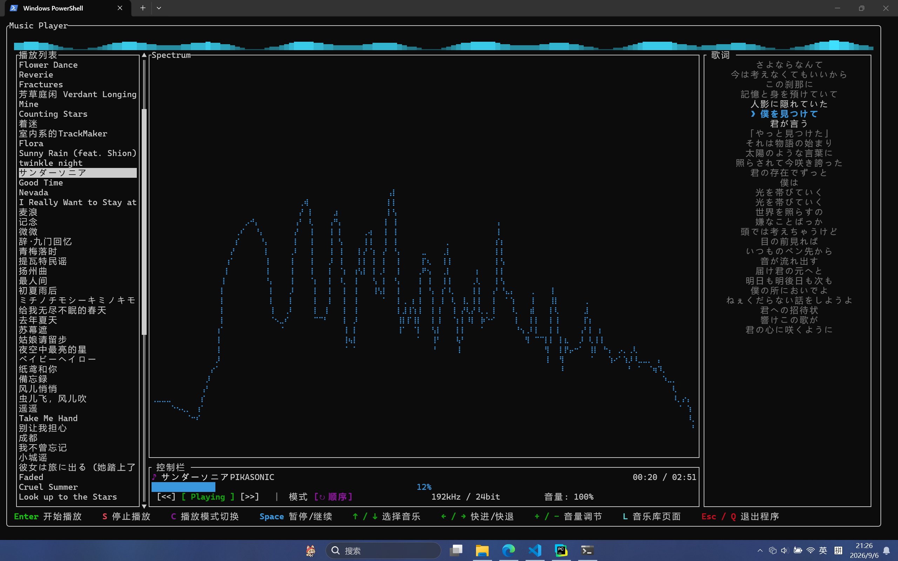

# Music Player

一个用 **Rust** 打造的终端音乐播放器（TUI）。基于 [`ratatui`](https://github.com/ratatui/ratatui) 渲染界面、[`rodio`](https://github.com/RustAudio/rodio) 播放音频、[`cpal`](https://github.com/RustAudio/cpal) 管理设备、[`sqlx` + SQLite](https://github.com/launchbadge/sqlx) 持久化音乐库，并内置频谱分析、歌词滚动、播放列表等完整功能。

##  功能特性

- **图形化 TUI 界面**：启动即进入「音乐库」页面，键盘全流程操作，无需鼠标。
- **音乐库管理**：导入整个文件夹，自动解析歌曲标题、艺术家、专辑、时长、**采样率、位深**，并以 SQLite 持久化。
- **播放列表**：从音乐库挑选/移除歌曲进播放列表（支持星标标记）。
- **播放控制**：播放/暂停、上一首/下一首、快进/快退、停止。
- **循环模式**：顺序播放、列表循环、单曲循环、随机播放（按下 `C` 循环切换）。
- **实时频谱**：基于 FFT 的柱状频谱，采用**对数频率分桶**，让低频到高频分布均匀，配合预取缓冲不卡顿。
- **歌词显示**：自动匹配同目录（或目录树内）的 `.lrc` 歌词文件，支持 UTF-8 / GBK 编码、滚动高亮、超长行自动换行。
- **音量调节**：支持按键调节音量，并持久化。
- **音频设备热切换**：系统默认输出设备变化（拔插耳机、系统设置里切换输出）时自动无缝重建音频流，继续播放。
- **动画状态栏**：主页面顶部一行动画均衡器，随播放状态跳动/静止，贴合整体冷色调。
- **预取缓冲**：后台线程预取音频，避免高码率音乐卡顿。

##  快速开始

### 环境要求

- Rust（建议使用较新版，项目基于 `edition 2024`）
- 支持标准终端（推荐 Windows Terminal / 现代 Linux/macOS 终端）

### 构建与运行

```bash
git https://github.com/Zzj-klwgxdz/TUIMusicPlayerByZzj.git
cd music-player
cargo run --release
```

## 操作说明

### 音乐库页面（启动默认）

| 按键 | 功能 |
| --- | --- |
| `I` | 导入音乐/歌词文件夹（弹出目录选择器） |
| `Space` | 加 / 移除播放列表（`*` 标记表示已在列表） |
| `↑` / `↓` | 选择音乐（滚轮滚动同样生效） |
| `M` | 进入主播放页面 |
| `Esc` / `Q` | 退出程序 |

### 主播放页面

| 按键 | 功能 |
| --- | --- |
| `Enter` | 开始播放（选中播放列表当前歌曲） |
| `Space` | 暂停 / 继续 |
| `S` | 停止播放 |
| `↑` / `↓` | 上一首 / 下一首 |
| `←` / `→` | 快退 / 快进 5 秒 |
| `+` / `-` | 音量加 / 减 |
| `C` | 循环模式切换（顺序 → 随机 → 列表 → 单曲） |
| `L` | 返回音乐库页面 |
| `Esc` / `Q` | 退出程序 |

> 主页面右下角控制栏会显示歌曲的采样率/位深（如 `192kHz / 24bit`）与播放进度。

## 技术架构

```
src/
├── main.rs            # 入口：日志、事件循环、帧刷新
├── app.rs             # 应用状态、键位处理、导入逻辑、设备检测
├── ui.rs              # ratatui 渲染（Library / Main 两个页面）
├── player.rs          # rodio 播放引擎、设备热切换、音量、seek
├── database.rs        # SQLite 数据库操作
├── prefetch.rs        # 后台预取缓冲
├── tui.rs             # 终端初始化 / 还原 + 鼠标捕获
├── event.rs           # 事件流（按键 / Tick / 鼠标）
└── components/        # UI 组件
    ├── control_bar_ui.rs   # 控制栏（进度、播放键、音量、质量信息）
    ├── lyric.rs            # 歌词解析与渲染
    ├── spectrum.rs         # FFT 频谱分析 + 对数分桶图表
    └── status_bar.rs       # 顶部动画状态栏
```

## 界面一览



## 实现要点

- **音频设备热切换**：程序轮询系统默认输出设备（用设备唯一 ID `DeviceTrait::id()` 与名称双重判断，避免本地化名称带来误判）；设备消失（拔耳机）时，rodio 流错误回调会静默置位 `device_lost` 标志，两者任一触发都会重建音频流到当前默认设备，并从原进度、原播放/暂停状态恢复。
- **预取缓冲防卡顿**：`PrefetchSource` 在后台线程解码/读取，音频线程只访问内存缓冲，解决高码率 FLAC 解码跟不上导致的声音卡顿。
- **对数分频 + 插值**：频谱用 `20Hz~20000Hz` 对数分桶聚合 FFT 结果，低频空桶用相邻非空桶线性插值填充，保证整条频率轴曲线连续、均匀。
- **歌词编码兼容**：`.lrc` 文件按 UTF-8 读取，失败时回退到 GBK（`encoding_rs`）解码。

## 日志 & 数据

- **数据库**：`music_meta.db`（SQLite），存放歌曲元信息与加载状态。
- **日志**：`logs/app.log`，按天滚动，自动删除3天前的日志，由 `tracing` 输出，可通过 `RUST_LOG` 环境变量调节级别（默认 `info`）。


## License

MIT